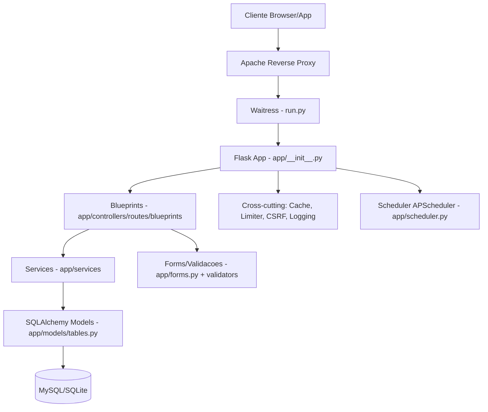

# Arquitetura da Aplicacao

Este documento descreve a arquitetura interna do portal Flask, com foco em organizacao de codigo, fluxo de requisicao e responsabilidades por modulo.

## Objetivo

- Facilitar onboarding tecnico.
- Ajudar manutencao e evolucao sem quebrar comportamentos existentes.
- Servir como mapa rapido de onde cada responsabilidade vive no codigo.

## Visao Geral

A aplicacao roda em arquitetura web classica:

1. `run.py` inicia o servidor Waitress.
2. `app/__init__.py` configura Flask, extensoes, seguranca e middlewares.
3. Rotas sao registradas por blueprints em `app/controllers/routes/blueprints/`.
4. Regras de negocio ficam em `app/services/`.
5. Persistencia e modelos ficam em `app/models/tables.py`.
6. Renderizacao web usa templates Jinja2 em `app/templates/`.

## Diagrama de Componentes



## Estrutura por Camada

### 1) Entrada e Servidor HTTP

- `run.py`
- Responsabilidade:
  - Inicializar Waitress.
  - Ler tuning por variavel de ambiente (threads, timeouts, backlog, buffers).
  - Configurar proxy confiavel (headers `X-Forwarded-*`) para ambiente com Apache.

### 2) Bootstrap da Aplicacao

- `app/__init__.py`
- Responsabilidade:
  - Configurar Flask e SQLAlchemy.
  - Carregar `.env`.
  - Inicializar extensoes: `CSRFProtect`, `Flask-Migrate`, `Flask-Login`, `Flask-Limiter`, `Flask-Compress`, cache.
  - Registrar blueprints e handlers globais.
  - Definir middlewares `before_request`, `after_request` e `teardown`.
  - Aplicar headers de seguranca e observabilidade.
  - Inicializar scheduler (quando habilitado).

### 3) Camada de Rotas (Controllers)

- `app/controllers/routes/__init__.py`
- `app/controllers/routes/blueprints/*.py`
- Responsabilidade:
  - Expor endpoints HTTP.
  - Autorizacao e validacao de entrada.
  - Orquestrar chamada de servicos.
  - Retornar HTML (Jinja) ou JSON (API).

Blueprints principais:

- `auth.py`: login/logout e OAuth.
- `core.py`: paginas principais.
- `tasks.py`: fluxo de tarefas.
- `empresas.py`: empresas e inventario relacionado.
- `reunioes.py` e `calendario.py`: agenda e reunioes.
- `notifications.py`: notificacoes e SSE.
- `notas.py`, `procedimentos.py`, `acessos.py`, `cursos.py`, `diretoria.py`, `societario.py`, `users.py`, `manual.py`.

### 4) Camada de Servicos (Regra de Negocio)

- `app/services/*.py`
- Responsabilidade:
  - Centralizar logica de negocio reutilizavel.
  - Integrar servicos externos (Google, CNPJ, notificacoes push).
  - Regras de calendario, reunioes, cache de dominio e exportacoes.

Servicos com papel forte:

- `meeting_room.py` e `meeting_recurrence.py`: regras de ciclo de reunioes.
- `google_calendar.py` e `general_calendar.py`: integracao e serializacao de eventos.
- `inventario_sync.py`: sincronizacoes e jobs de inventario.
- `realtime.py` e `push_notifications.py`: comunicacao near real-time.

### 5) Camada de Dados

- `app/models/tables.py`
- `migrations/`
- Responsabilidade:
  - Modelos ORM (usuarios, tarefas, empresas, reunioes, notas, etc.).
  - Enumeracoes de status/prioridade.
  - Relacionamentos e constraints.
  - Evolucao de schema via Alembic.

Observacao: `app/__init__.py` tambem contem blocos de compatibilidade/migracoes defensivas em runtime para bases legadas.

### 6) Camada de Interface

- `app/templates/`
- `app/static/`
- Responsabilidade:
  - Renderizacao server-side com Jinja2.
  - JS/CSS de comportamento de tela.
  - Assets PWA (`sw.js`, `manifest.json`) e recursos de frontend.

## Fluxo de Requisicao (Padrao)

1. Requisicao chega no Apache e eh encaminhada ao Waitress.
2. Waitress entrega ao Flask.
3. Hooks `before_request` executam:
   - redirecionamento HTTPS (quando ativo),
   - timer/performance tracking,
   - atualizacao de atividade de sessao.
4. Blueprint resolve rota e executa regra de negocio (direto ou via `services`).
5. SQLAlchemy consulta/persiste no banco.
6. Hooks `after_request` aplicam:
   - headers de seguranca (CSP, HSTS, etc.),
   - logging estruturado e `X-Request-ID`.
7. `teardown_appcontext` finaliza commit de atualizacao de sessao (quando necessario).

## Componentes Transversais

- Seguranca:
  - CSRF global.
  - Cookies `HttpOnly`, `Secure`, `SameSite` conforme ambiente.
  - CSP e headers anti-clickjacking.
  - Rate limiting com Flask-Limiter.
- Performance:
  - Compressao HTTP (gzip/br).
  - Cache via `Flask-Caching` (Redis ou SimpleCache fallback).
  - Tracking de requisicoes lentas.
- Observabilidade:
  - Logging estruturado com rotacao.
  - Endpoints de health/diagnostico.
  - Middleware de tempo de request e spans de commit.
- Assincronismo leve:
  - `app/extensions/task_queue.py` para IO em background com `ThreadPoolExecutor`.
  - `app/scheduler.py` para jobs recorrentes via APScheduler.

## Organizacao de Pastas (Resumo)

```text
app/
  __init__.py
  controllers/
    routes/
      __init__.py
      blueprints/
  models/
    tables.py
  services/
  extensions/
  utils/
  templates/
  static/
migrations/
run.py
```

## Principios de Evolucao

- Novas features HTTP devem nascer em blueprint dedicado em `app/controllers/routes/blueprints/`.
- Regras de negocio reutilizaveis devem ir para `app/services/` (evitar controllers gordos).
- Acesso a dados deve reutilizar modelos/queries centralizados, com invalidador de cache quando houver mutacao.
- Mudancas de schema devem ser feitas por migration em `migrations/versions/` (evitar depender apenas de alteracoes em runtime).
- Funcionalidade transversal (seguranca, logging, performance) deve ser adicionada em `app/__init__.py`, `app/extensions/` ou `app/utils/`.

## Riscos Tecnicos Atuais (Arquitetura)

- `app/__init__.py` concentra muitas responsabilidades; candidatos a extracao: config, middleware, bootstrap de extensoes, compatibilidade de schema.
- Existe mistura de migrations formais (Alembic) com ajustes runtime de schema para legado; isso aumenta complexidade operacional.
- Compatibilidade com endpoints legados por aliases em blueprints e util, mas exige cuidado para evitar conflito de nome de endpoint.

## Referencias Rapidas

- Arquitetura infra/proxy: `docs/PROXY_REVERSO.md`
- Operacao Apache: `docs/MANUTENCAO_APACHE.md`
- Fluxos funcionais: `docs/FLUXOGRAMAS.md`
- API REST: `docs/API_DOCUMENTATION.md`
